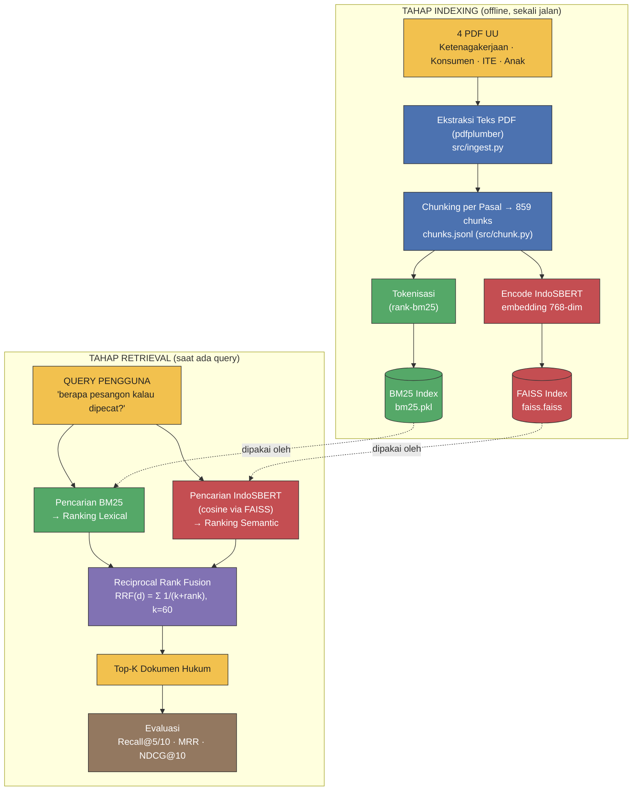
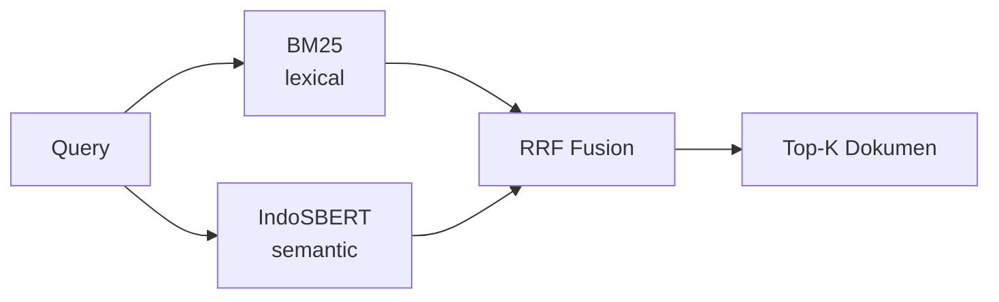

# Diagram Pipeline Sistem

Sumber diagram dalam format **Mermaid** (mudah diedit, render otomatis di GitHub
& VSCode dengan ekstensi Markdown Preview Mermaid). Versi gambar siap-PowerPoint
ada di [`pipeline_diagram.png`](pipeline_diagram.png).

## Versi ringkas (untuk slide ikhtisar)

