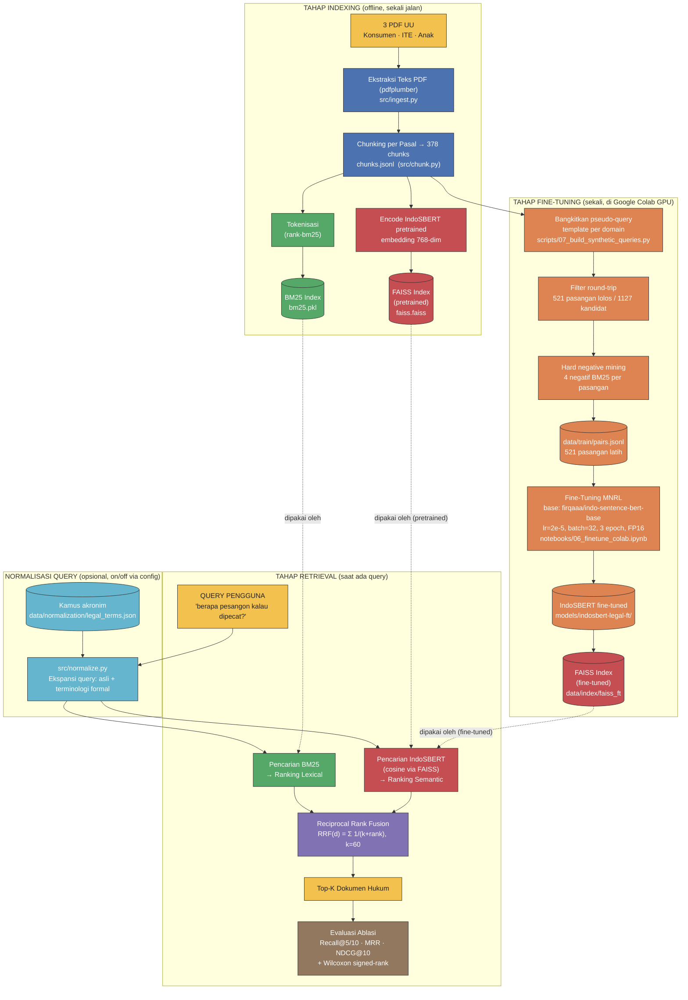
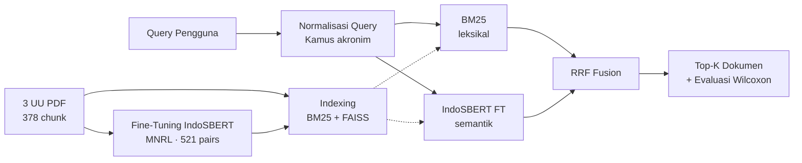

# Diagram Pipeline Sistem

Sumber diagram dalam format **Mermaid** (mudah diedit, render otomatis di GitHub
& VSCode dengan ekstensi Markdown Preview Mermaid).

## Pipeline lengkap (indexing + fine-tuning + retrieval)

## Versi ringkas (untuk slide ikhtisar)

## Konfigurasi ablasi (5 sistem × 2 kondisi normalisasi)

| Sistem | Cabang FAISS | Normalisasi |
|---|---|---|
| BM25 | — | tanpa / dengan |
| IndoSBERT pretrained | `faiss.faiss` | tanpa / dengan |
| IndoSBERT fine-tuned | `faiss_ft/` | tanpa / dengan |
| Pre-hybrid (BM25 + pretrained + RRF) | `faiss.faiss` | tanpa / dengan |
| Fine-hybrid (BM25 + fine-tuned + RRF) | `faiss_ft/` | tanpa / dengan |
